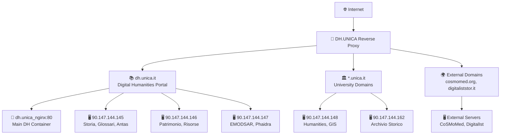

# 🌐 DH.UNICA Reverse Proxy

<div align="center">
  
[](https://www.docker.com/)
[](https://nginx.org/)
[](https://letsencrypt.org/)
[](https://www.unica.it/)

*Un reverse proxy nginx containerizzato per l'ecosistema Digital Humanities dell'Università di Cagliari*

</div>

---

## 📋 Panoramica

Questo progetto implementa un **reverse proxy nginx** ad alta disponibilità che gestisce il traffico per **47+ siti web** dell'Università di Cagliari, principalmente focalizzati sulle Digital Humanities. Il sistema route intelligentemente le richieste tra domini pubblici e servizi backend distribuiti.

- 🐳 **Containerizzato** - Deployment semplificato con Docker
- 🔐 **SSL/TLS Completo** - Certificati DigiCert CA e Let's Encrypt
- 🌍 **Multi-dominio** - Supporto per domini `.unica.it`, `.dh.unica.it` e domini esterni
- ⚡ **Alta Performance** - Compressione gzip e ottimizzazioni avanzate
- 🛡️ **Sicurezza** - Protezione PHP, autenticazione e headers di sicurezza

---

## 🏗️ Architettura



---

## 🚀 Quick Start

### Prerequisiti

- 🐳 Docker & Docker Compose
- 🔐 Certificati SSL (DigiCert CA o Let's Encrypt)
- 🌐 Accesso alla rete dei server backend

### Installazione Rapida

```bash
# Clone del repository
git clone https://github.com/caprowsky/proxy.dh.unica.git
cd proxy.dh.unica

# Avvio del reverse proxy
docker-compose up -d

# Verifica dello stato
docker logs dhunica_proxypass
```

### Configurazione SSL

```bash
# Posiziona i certificati nelle directory appropriate:
# - DigiCert CA: /etc/digicertca/live/dh.unica.it/
# - Let's Encrypt: /etc/letsencrypt/live/domain/

# Rinnovo automatico certificati Let's Encrypt
./nginx-certs.sh
```

---

## 🛠️ Gestione Operativa

### Comandi Principali

| Comando | Descrizione | Uso |
|---------|-------------|-----|
| `./nginx-reload.sh` | 🔄 Ricarica configurazione senza downtime | Modifiche alle configurazioni |
| `./nginx-restart.sh` | 🔄 Restart completo del container | Cambiamenti strutturali |
| `./nginx-reset.sh` | 🔄 Rebuild completo | Problemi critici |
| `./nginx-certs.sh` | 🔐 Rinnovo certificati SSL | Manutenzione certificati |

### Aggiungere un Nuovo Sito

1. **Crea il file di configurazione** in `sites-enabled/`:
```bash
# Per sottodomini DH: sottodominio_dhunica.conf
# Per domini UNICA: dominio.conf  
# Per domini esterni: dominio.conf
```

2. **Configura SSL proof directory**:
```bash
mkdir -p ssl-proof/nuovo-dominio/
```

3. **Applica la configurazione**:
```bash
./nginx-reload.sh
```

### Monitoraggio e Debug

```bash
# Log del container
docker logs dhunica_proxypass

# Test configurazione nginx
docker exec dhunica_proxypass nginx -t

# Verifica connessioni backend
curl -I https://storia.dh.unica.it/colonizzazioninterne
```

---

## 🌍 Siti Web Gestiti

### 📊 Statistiche Generali
- **48 URL pubbliche** distinte
- **7 domini principali** (dh.unica.it, unica.it, cosmomed.org, digitaliststor.it, thelastofus.it, atliteg.org)
- **23 sottoprogetti** del dominio dh.unica.it
- **8 server backend** fisici/virtuali

### 🏛️ Domini Principali

#### Digital Humanities (dh.unica.it)
```
🏠 https://dh.unica.it                    - Portale principale
📚 https://storia.dh.unica.it            - Progetto Storia  
🎨 https://arte.dh.unica.it              - Progetto Arte
🗺️ https://geografia.dh.unica.it         - Progetto Geografia
📖 https://letteratura.dh.unica.it       - Progetto Letteratura
🎵 https://musica.dh.unica.it            - Progetto Musica
... e molti altri!
```

#### Università di Cagliari (unica.it)
```
🏛️ https://archiviostorico.unica.it      - Archivio Storico
🎓 https://humanities.unica.it            - Portale Humanities  
📅 https://400.unica.it                   - 400 Anni Ateneo
📦 https://patrimonio.archiviostorico.unica.it - Gestione Patrimonio
```

#### Domini Esterni
```
🗺️ https://atlante.atliteg.org           - Atlante ATLITEG
🌍 https://www.cosmomed.org               - CoSMoMed Project
📚 https://www.digitaliststor.it          - Istituto Storia Digitale

```

> 📋 **Lista completa**: Vedi [SITI_WEB_REVERSE_PROXY.md](doc/SITI_WEB_REVERSE_PROXY.md) per la tabella dettagliata di tutti i siti.

---

## ⚙️ Configurazione Tecnica

### Struttura Directory

```
proxy.dh.unica/
├── 🐳 docker-compose.yml          # Configurazione container
├── 📋 Dockerfile                  # Immagine nginx custom
├── ⚙️ sites-enabled/              # Configurazioni nginx
│   ├── dhunica.conf              # Dominio principale
│   ├── *_dhunica.conf            # Sottoprogetti DH
│   └── *.conf                    # Altri domini
├── 🔐 ssl-proof/                 # Directory SSL proof
├── 🔑 htpassword/                # File autenticazione
├── 🔄 redirect/                  # Configurazioni redirect
├── 🌐 html/                      # Contenuti statici
└── 📜 scripts di gestione        # nginx-*.sh
```

### Pattern Configurazione Nginx

Ogni sito segue questo template standardizzato:

```nginx
server {
    listen 80;
    server_name example.dh.unica.it;
    return 301 https://example.dh.unica.it$request_uri;
}

server {
    listen 443 ssl;
    server_name example.dh.unica.it;
    
    # SSL Certificates
    ssl_certificate /etc/digicertca/live/dh.unica.it/Cert_bundle.pem;
    ssl_certificate_key /etc/digicertca/live/dh.unica.it/dh.key;
    
    # SSL Proof per ACME challenges
    location /.well-known {
        root /var/www/ssl-proof/dhunica/;
    }
    
    # Proxy principale
    location / {
        proxy_pass http://backend:port;
        proxy_set_header Host $host;
        proxy_set_header X-Forwarded-Proto $scheme;
        # ... altri headers standard
    }
    
    # Sicurezza PHP
    location ~* /files/.*.php$ {
        deny all;
    }
}
```

### Ottimizzazioni Performance

- **Compressione gzip** attiva su tutti i siti
- **Client max body size**: 4000MB per upload grandi
- **Proxy timeout**: 900 secondi per operazioni lunghe  
- **Buffer ottimizzati** per traffico intenso

---

## 🔒 Sicurezza e SSL

### Strategia Certificati

| Tipo Domain | Certificato | Path |
|-------------|-------------|------|
| `*.dh.unica.it` | DigiCert CA | `/etc/digicertca/live/dh.unica.it/` |
| `*.unica.it` | DigiCert CA | `/etc/digicertca/live/domain/` |
| Domini esterni | Let's Encrypt | `/etc/letsencrypt/live/domain/` |

### Misure di Sicurezza

- ✅ **Redirect HTTPS automatico** per tutti i domini
- ✅ **Blocco file PHP** in directory uploads (`/files/`)
- ✅ **Headers di sicurezza** standard
- ✅ **Autenticazione HTTP Basic** disponibile
- ✅ **SSL proof directories** per validazione certificati

---

## 🔧 Troubleshooting

### Problemi Comuni

<details>
<summary><strong>🔴 Sito non raggiungibile</strong></summary>

```bash
# Verifica stato container
docker ps | grep dhunica

# Controlla logs
docker logs dhunica_proxypass

# Test configurazione
docker exec dhunica_proxypass nginx -t
```
</details>

<details>
<summary><strong>🔴 Errore SSL</strong></summary>

```bash
# Verifica certificati
ls -la /etc/digicertca/live/dh.unica.it/
ls -la /etc/letsencrypt/live/domain/

# Rinnova certificati
./nginx-certs.sh
```
</details>

<details>
<summary><strong>🔴 Backend non risponde</strong></summary>

```bash
# Test connettività backend
curl -I http://90.147.144.145:7000
curl -I http://dh.unica_nginx:80

# Verifica reti Docker
docker network ls | grep dhunica
```
</details>

### Log e Monitoring

```bash
# Monitoring in tempo reale
docker logs -f dhunica_proxypass

# Analisi errori
docker logs dhunica_proxypass 2>&1 | grep -i error

# Test completo connettività
for url in storia.dh.unica.it arte.dh.unica.it; do
  echo "Testing $url..."
  curl -I "https://$url"
done
```

---

## 🤝 Contributi

### Sviluppo

1. **Fork** del repository
2. **Crea branch** per la feature: `git checkout -b feature/nuovo-sito`  
3. **Commit** delle modifiche: `git commit -am 'Add nuovo sito'`
4. **Push** del branch: `git push origin feature/nuovo-sito`
5. **Pull Request** per review

### Convenzioni

- **Naming**: Seguire i pattern esistenti per i file `.conf`
- **SSL**: Configurare sempre SSL proof directory
- **Testing**: Testare con `nginx -t` prima del deploy
- **Documentation**: Aggiornare `SITI_WEB_REVERSE_PROXY.md`

---

## 📚 Documentazione

- 📋 **[Lista Completa Siti](/doc/SITI_WEB_REVERSE_PROXY.md)** - Tutti i 47 siti web gestiti
- ⚙️ **[Copilot Instructions](.github/copilot-instructions.md)** - Guide per AI agents  
- 🐳 **[Docker Compose](docker-compose.yml)** - Configurazione container
- 📜 **[Scripts di Gestione](nginx-*.sh)** - Automazione operazioni

---

## 📄 Licenza

Questo progetto è sviluppato per l'**Università di Cagliari** - Dipartimento Digital Humanities.

---

## 👥 Contatti

- 🏛️ **Università di Cagliari** - [unica.it](https://www.unica.it)
- 📚 **Digital Humanities** - [dh.unica.it](https://dh.unica.it)
- 💻 **Repository** - [github.com/caprowsky/proxy.dh.unica](https://github.com/caprowsky/proxy.dh.unica)

---

<div align="center">

**Fatto con ❤️ per la comunità Digital Humanities dell'Università degli Studi di Cagliari**

[](https://www.unica.it/)

</div># Last update: ven 3 ott 2025, 12:51:16, CEST
# Webhook deploy system configured - ven 3 ott 2025, 16:48:10, CEST 
